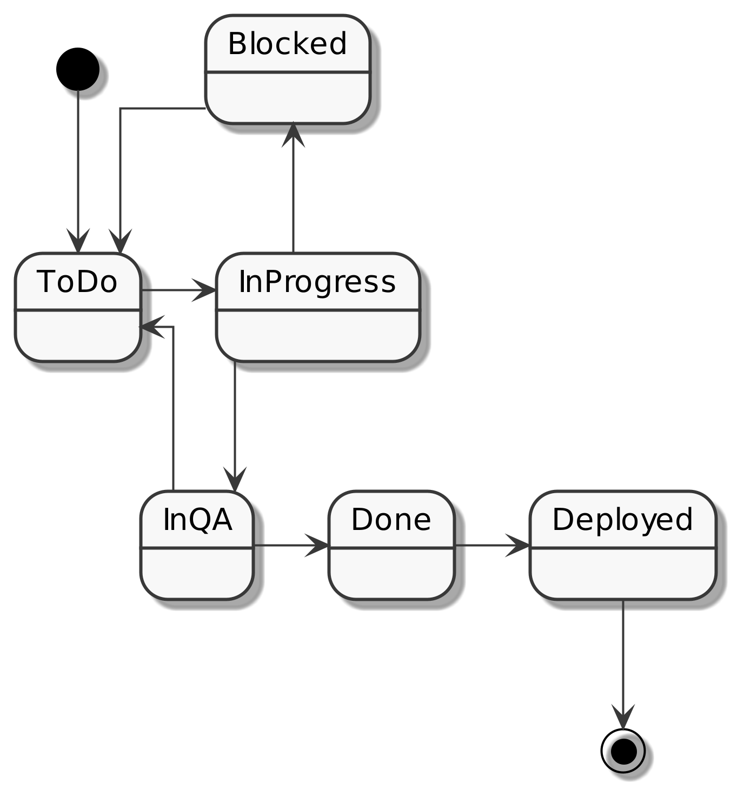

# Task Manager with React (Context API) and TypeScript

This application was implemented base on this user story: 

* each can create tasks, so that all tasks for a project can be tracked.
  * A task must have a title
  * A task must have a long description
  * A task must have the status "ToDo"
* user can change the status of a Task, so that the progress of the project can be tracked.
  * Only the following status transitions are allowed, see __[state transitions](#state-transitions)__
* user can change the title and long description of a task.
* user will see the history of a Task
  * The previous and the next value of a change must be tracked

So for example:
- If a task is currently at "toDo" state in can only be changed to "InProgress"
- If a task is currently at "inQA" state in can only be both changed to "Done" or "ToDo"

## Features

This application was developed by TypeScript, React, Hooks and Context API based on user stories whit these features: 

- using **react-router-dom** package to handle routing
- using **nanoid** package to handle unique ID of each Task
- tasks can be removed 
- task can be filtered in dashboard based on the **text** and the **status** 
- using Material UI 
- 404 page to handle non-existed URLs
- using custom hooks
- using LocalStorage API
- Mobile and Desktop Ready

### Note

------

This project was bootstrapped with [Create React App](https://github.com/facebook/create-react-app).  so yo can: 

So , you can run:

### `yarn start`

Runs the app in the development mode. and open [http://localhost:3000](*http://localhost:3000*) to view it in the browser.

you can run test: 

### `yarn test`

and you can run build: 

### `yarn build`

Builds the app for production to the `build` folder.